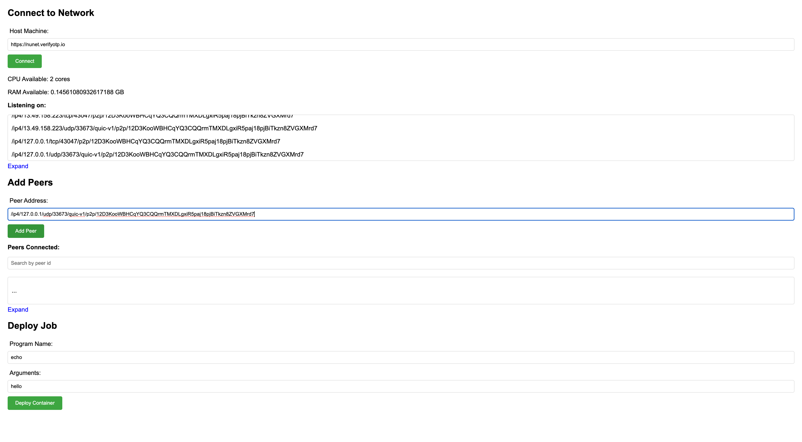
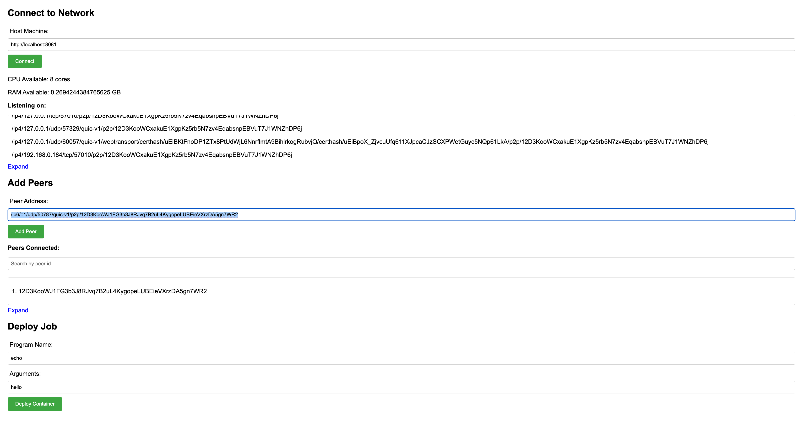
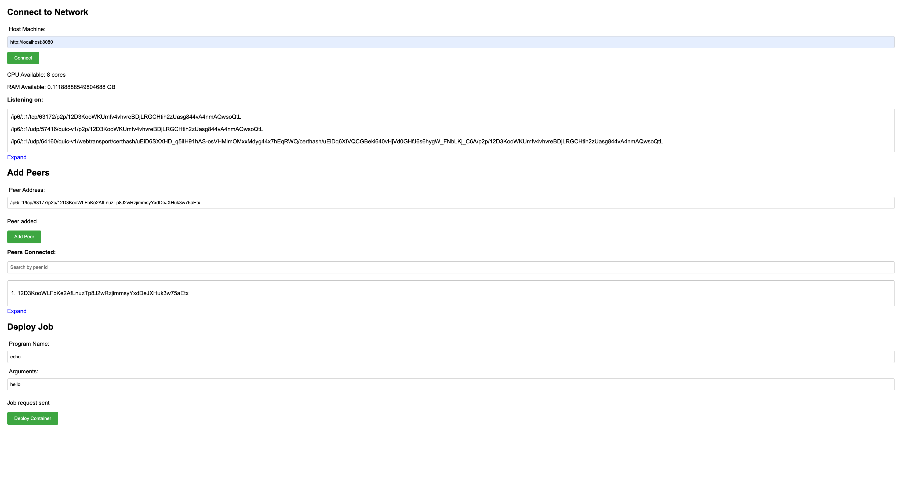
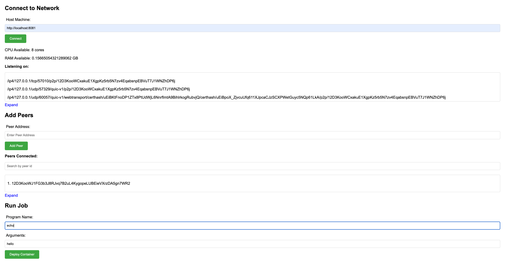
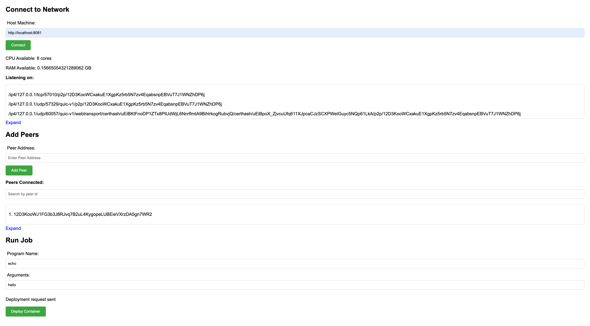
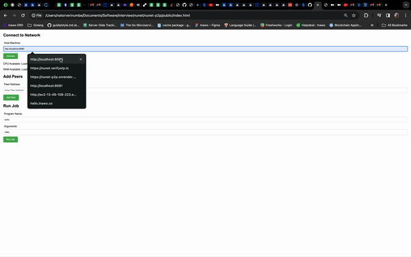

## **Project Documentation: Nunet Job/Container Manager Application**

**Project Overview:**
- **UI:** [Nunet P2P UI](https://iamnator.github.io/nunet-p2p/)
- **Bootstrap Node:** [Nunet Bootstrap Node](https://nunet.verifyotp.io)

**Thought Process:**
- Initially, I considered implementing the solution using a REST API with hard-coded addresses for peer communication. I developed a basic solution based on this approach, which worked effectively.
- However, upon considering scenarios involving more than two machines, I recognized the limitations of this approach. Recalling previous encounters with libp2p, I realized it offered comprehensive solutions for peer discovery and communication.
- With this in mind, I pivoted to building an application utilizing a single pubsub topic. Additionally, I created a simple HTML/JS UI to facilitate interaction with the program. To enhance peer discovery, I incorporated functionality for users to directly connect to specified peers.
- To fully test the solution, I deployed a copy on AWS EC2. Considering Nunet's objective of distributed computing, I recognized the importance of knowing the available computing resources of each node. This led to the consideration of resource-based task assignment.
- For program execution, I implemented a mechanism for the source program to receive a response upon job completion, necessitating the creation of another pubsub topic for responses.

**Other Considerations:**
- I made an effort to minimize reliance on external services such as databases, queues, or pubsub systems like Kafka. This ensures the system's operability in environments with limited or no internet connectivity.

**Limitations and Possible Improvements:**
- Instead of pubsub, employing streams from libp2p could reduce network load.
- Implementing a mechanism to pass the job to another machine if the target machine lacks the necessary resources could improve efficiency.

**Difficulties Encountered:**
- I had limited experience with libp2p initially, but I found the learning and implementation process exciting and rewarding.

---

## **Using the Application: A Developer's Guide**

**Introduction:**
This guide aims to walk you through the steps of utilizing the Nunet P2P Application for seamless peer-to-peer communication and distributed computing. Below, we provide detailed instructions on connecting to a node, adding a peer, and running a job. Accompanied by screenshots, this guide ensures an easy and developer-friendly experience.

**Connecting to a Node:**

1. **Accessing the UI:** Open your preferred web browser and navigate to the [Nunet P2P UI](https://iamnator.github.io/nunet-p2p/).

2. **Enter Host Machine Address:** Input the address of the host machine (e.g., https://nunet.verifyotp.io ) into the provided field and hit "Connect".


**Adding a Peer:**

1. **Initiating Peer Addition:** After establishing connection with a host machine, proceed to add peers to the network by clicking on the "Add Peer" button within the UI.

   

2. **Provide Peer Details:** Input the address of the peer you wish to add into the corresponding fields.

   

3. **Confirmation:** Once the peer details are entered, click "Add Peer" to incorporate the peer into the network. A confirmation message will verify the addition.

   

`The programs automatically handles peer discovery; this process simply expedites the operation.`

**Running a Job:**

1. **Provide Job Details:** Specify the program and its arguments for the job within the designated fields.

   

2. **Job Execution:** Upon entering the job details, initiate the job execution by clicking "Run Job". A confirmation message will indicate successful job execution.

   


**Local Testing Guide**

**Introduction:**
Testing the Nunet P2P Application locally is a crucial step in ensuring its functionality and reliability. This guide provides instructions on setting up and testing the application on your local machine. By running two instances of the program and connecting them via the UI, you can simulate peer-to-peer communication and execute jobs effectively.

**Setting Up Local Testing Environment:**

1. **Clone Repository:** Begin by cloning the Nunet P2P Application repository to your local machine:

   ```bash
   git clone https://github.com/IamNator/nunet-p2p.git
   ```

2. **Navigate to Directory:** Move into the project directory:

   ```bash
   cd nunet-p2p
   ```

3. **Run Instances:** Open two terminal windows and run an instance of the program in each:

   ```bash
   go run main.go
   ```

4. **Access UI:** Open two instances of the Nunet UI in your web browser. You can do this by navigating to [Nunet Local UI](./public/index.html) in two separate browser tabs or windows.

**Testing Peer Communication and Job Execution:**

1. **Connect Instances:** In one UI instance, connect to the first program instance by following the steps outlined in the "Connecting to a Node" section of this guide.

2. **Add Peer:** Use the same UI instance to add the second program instance as a peer, following the steps provided in the "Adding a Peer" section.

3. **Confirm Connection:** Verify successful connection and peer addition through the UI interface.

4. **Execute Job:** Within the UI, initiate a job execution targeting the second program instance by following the steps outlined in the "Running a Job" section.



**Local Testing Conclusion:**
By following these steps, you have successfully set up and tested the Nunet P2P Application locally. Through this process, you've simulated peer-to-peer communication and executed a job between two instances of the program. This local testing ensures the robustness and reliability of the application before deployment to production environments. Feel free to explore additional features and functionalities to further enhance your testing experience.


